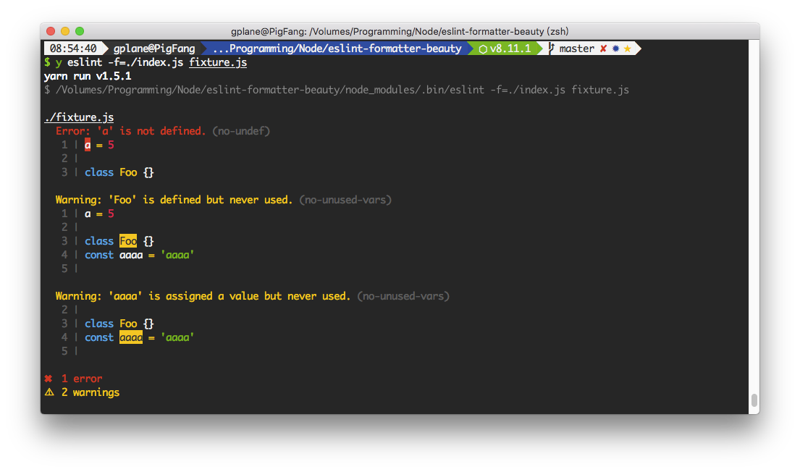

# eslint-formatter-beauty

Beautiful ESLint formatter.




## Installation

Using Yarn:

```
yarn add --dev eslint-formatter-beauty
```

Using npm:

```
npm install --save-dev eslint-formatter-beauty
```

## Usage

### ESLint CLI:

```
eslint -f=beauty path/to/your/file.js
```

### gulp-eslint

```js
const gulp = require('gulp')
const eslint = require('gulp-eslint')

gulp.task('lint', () =>
  gulp.src('file.js')
    .pipe(eslint())
    .pipe(eslint.format(require('eslint-formatter-beauty')))
)
```

### eslint-loader

```js
module.exports = {
  // ... other options
  module: {
    rules: [
      // ... other options
      {
        test: /\.js$/,
        exclude: /node_modules/,
        loader: 'eslint-loader',
        options: {
          formatter: require('eslint-formatter-beauty')
        }
      }
    ]
  }
}
```

## Related Projects

- [tslint-formatter-beauty](https://github.com/g-plane/tslint-formatter-beauty)

## License

MIT License

Copyright (c) 2018-present Pig Fang
